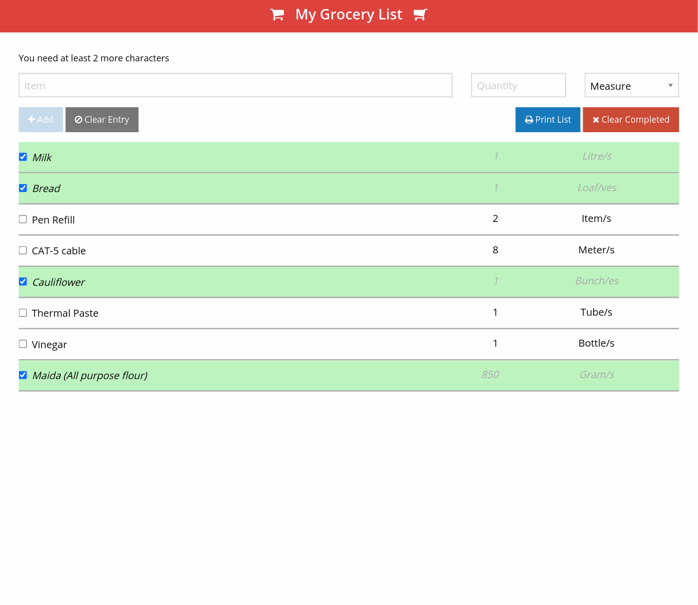

<h1 align="center">Grocery Check List using AngularJS/PHP</h1>

## Summary

This app was built using AngularJS and Zurb Foundation on the frontend and PHP on the backend. It has a responsive layout and has options to clear completed items, or individual items and an option to print the entire list. Please try it out using the 'Demo' link at the bottom.

## Screenshot

## Tools used

- HTML
- CSS
- AngularJS
- Zurb Foundation 5
- PHP

## Try it out

- [Demo](https://polar-refuge-37402.herokuapp.com)
